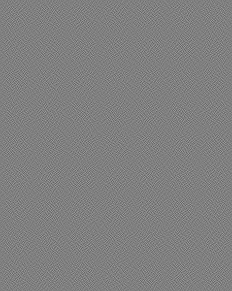
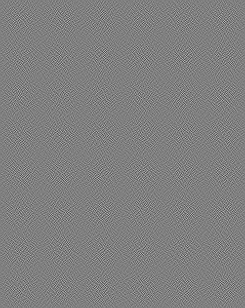
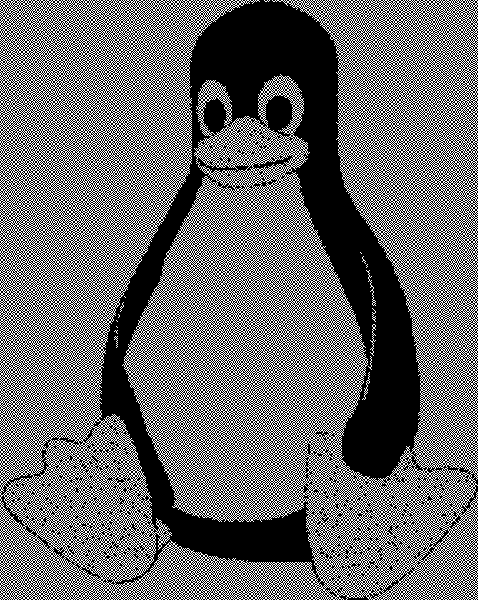

# xim

CLI-tool to create a pair of images that when overlayed display the input image

## Example
Transforming an image like 
```sh
xim --image image.png
```


creates two separate image files



and



When overlayed, these images look like this:


